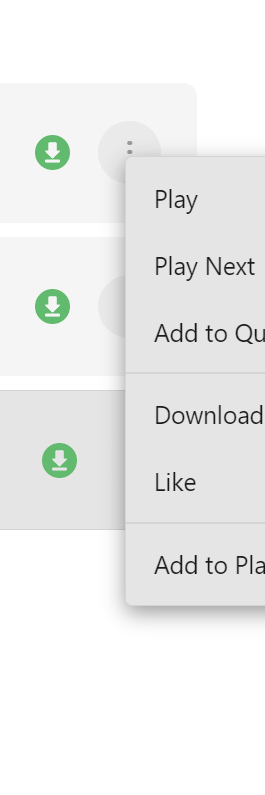

# UB-WaveX API Documentation

## IPC Communication Protocol

Communication between Electron and Python uses JSON over STDIN/STDOUT.

### Request Format

```json
{
  "request_id": 1,
  "action": "action_name",
  "params": {
    "param1": "value1",
    "param2": "value2"
  }
}
```

### Response Format

**Success:**
```json
{
  "request_id": 1,
  "status": "success",
  "data": { /* result data */ }
}
```

**Error:**
```json
{
  "request_id": 1,
  "status": "error",
  "error": "Error message"
}
```

---

## Python Core Actions

### 1. Search Music

**Action:** `search`

**Parameters:**
```json
{
  "query": "string"  // Search query
}
```

**Returns:**
```json
[
  {
    "youtube_id": "string",
    "title": "string",
    "duration": 180,  // seconds
    "thumbnail": "url",
    "uploader": "string"
  }
]
```

**Example:**
```javascript
const result = await ipcRenderer.invoke('search-music', 'Taylor Swift');
```

---

### 2. Get Stream URL

**Action:** `get_stream_url`

**Parameters:**
```json
{
  "video_id": "string"  // YouTube video ID
}
```

**Returns:**
```json
{
  "url": "string",  // Direct stream URL
  "title": "string",
  "duration": 180,
  "artist": "string",
  "thumbnail": "url"
}
```

**Example:**
```javascript
const result = await ipcRenderer.invoke('get-stream-url', 'dQw4w9WgXcQ');
```

**Notes:**
- Stream URLs expire after 6 hours
- URLs are cached automatically
- Track metadata is saved to database

---

### 3. Download Track

**Action:** `download_track`

**Parameters:**
```json
{
  "video_id": "string",
  "title": "string",
  "artist": "string",
  "duration": 180
}
```

**Returns:**
```json
{
  "track_id": 1,
  "file_path": "C:\\Users\\...\\track.mp3",
  "title": "string",
  "artist": "string"
}
```

**Example:**
```javascript
const result = await ipcRenderer.invoke('download-track', {
  video_id: 'dQw4w9WgXcQ',
  title: 'Song Title',
  artist: 'Artist Name',
  duration: 212
});
```

**Notes:**
- Downloads as 320kbps MP3
- Embeds metadata and cover art
- Saves to downloads folder
- Updates database automatically

---

### 4. Resolve Metadata

**Action:** `resolve_metadata`

**Parameters:**
```json
{
  "title": "string",
  "artist": "string",
  "thumbnail": "url"  // optional
}
```

**Returns:**
```json
{
  "title": "string",
  "artist": "string",
  "album": "string",
  "release_date": "2024-01-01",
  "cover_art_url": "url",
  "musicbrainz_artist_id": "uuid",
  "musicbrainz_album_id": "uuid"
}
```

**Example:**
```javascript
const result = await ipcRenderer.invoke('resolve-metadata', {
  title: 'Song Title',
  artist: 'Artist Name'
});
```

**Notes:**
- Queries MusicBrainz API
- Fetches cover art from Cover Art Archive
- Falls back to YouTube thumbnail
- Metadata cached for 30 days

---

## Electron IPC Handlers

### Database Operations

#### Get All Tracks

```javascript
const result = await ipcRenderer.invoke('db-get-tracks');
// Returns: { success: true, data: [...tracks] }
```

#### Get Downloaded Tracks

```javascript
const result = await ipcRenderer.invoke('db-get-downloads');
// Returns: { success: true, data: [...tracks with download info] }
```

#### Get Liked Songs

```javascript
const result = await ipcRenderer.invoke('db-get-liked');
// Returns: { success: true, data: [...liked tracks] }
```

#### Toggle Like Status

```javascript
const result = await ipcRenderer.invoke('db-toggle-like', trackId);
// Returns: { success: true, liked: true/false }
```

---

### Playlist Operations

#### Get All Playlists

```javascript
const result = await ipcRenderer.invoke('db-get-playlists');
// Returns: { success: true, data: [...playlists] }
```

#### Create Playlist

```javascript
const result = await ipcRenderer.invoke('db-create-playlist', 'My Playlist');
// Returns: { success: true, playlistId: 1 }
```

#### Get Playlist Tracks

```javascript
const result = await ipcRenderer.invoke('db-get-playlist-tracks', playlistId);
// Returns: { success: true, data: [...tracks] }
```

#### Add Track to Playlist

```javascript
const result = await ipcRenderer.invoke('db-add-to-playlist', {
  playlistId: 1,
  trackId: 5
});
// Returns: { success: true }
```

#### Remove Track from Playlist

```javascript
const result = await ipcRenderer.invoke('db-remove-from-playlist', {
  playlistId: 1,
  trackId: 5
});
// Returns: { success: true }
```

#### Rename Playlist

```javascript
const result = await ipcRenderer.invoke('db-rename-playlist', {
  playlistId: 1,
  name: 'New Name'
});
// Returns: { success: true }
```

#### Delete Playlist

```javascript
const result = await ipcRenderer.invoke('db-delete-playlist', playlistId);
// Returns: { success: true }
```

---

## Player API

### Global Functions

#### Play Track

```javascript
window.playTrack(track);
```

**Parameters:**
- `track`: Track object with `youtube_id`, `title`, `artist`, etc.

**Behavior:**
- Clears current queue
- Loads and plays the track immediately
- Updates player UI

---

#### Play Queue

```javascript
window.playQueue(tracks, startIndex);
```

**Parameters:**
- `tracks`: Array of track objects
- `startIndex`: Index to start playing from (default: 0)

**Behavior:**
- Loads entire queue
- Starts playing from specified index
- Auto-plays next tracks sequentially
- Preloads upcoming tracks (max 5)

---

#### Add to Queue

```javascript
window.addToQueue(track, playNext);
```

**Parameters:**
- `track`: Track object
- `playNext`: Boolean - if true, adds after current track

**Behavior:**
- Adds track to queue
- Does not interrupt current playback

---

## Database Schema Reference

### Tracks Table

```sql
CREATE TABLE tracks (
    id INT PRIMARY KEY AUTO_INCREMENT,
    title VARCHAR(255),
    artist_id INT,
    album_id INT,
    duration INT,
    youtube_id VARCHAR(20) UNIQUE,
    cover_image_path VARCHAR(512),
    created_at TIMESTAMP
);
```

### Artists Table

```sql
CREATE TABLE artists (
    id INT PRIMARY KEY AUTO_INCREMENT,
    name VARCHAR(255),
    musicbrainz_id VARCHAR(36) UNIQUE,
    created_at TIMESTAMP
);
```

### Albums Table

```sql
CREATE TABLE albums (
    id INT PRIMARY KEY AUTO_INCREMENT,
    title VARCHAR(255),
    artist_id INT,
    release_date DATE,
    musicbrainz_id VARCHAR(36) UNIQUE,
    cover_art_path VARCHAR(512),
    created_at TIMESTAMP
);
```

### Downloads Table

```sql
CREATE TABLE downloads (
    id INT PRIMARY KEY AUTO_INCREMENT,
    track_id INT UNIQUE,
    file_path VARCHAR(512),
    file_size BIGINT,
    quality VARCHAR(20),
    downloaded_at TIMESTAMP
);
```

### Liked Songs Table

```sql
CREATE TABLE liked_songs (
    id INT PRIMARY KEY AUTO_INCREMENT,
    track_id INT UNIQUE,
    liked_at TIMESTAMP
);
```

### Playlists Table

```sql
CREATE TABLE playlists (
    id INT PRIMARY KEY AUTO_INCREMENT,
    name VARCHAR(255),
    description TEXT,
    cover_image_path VARCHAR(512),
    created_at TIMESTAMP,
    updated_at TIMESTAMP
);
```

### Playlist Tracks Table

```sql
CREATE TABLE playlist_tracks (
    id INT PRIMARY KEY AUTO_INCREMENT,
    playlist_id INT,
    track_id INT,
    position INT,
    added_at TIMESTAMP,
    UNIQUE(playlist_id, track_id)
);
```

### Cache Table

```sql
CREATE TABLE cache (
    id INT PRIMARY KEY AUTO_INCREMENT,
    cache_key VARCHAR(255),
    cache_type ENUM('metadata', 'stream_url', 'cover_art', 'search_result'),
    cache_data TEXT,
    created_at TIMESTAMP,
    expires_at TIMESTAMP,
    UNIQUE(cache_key, cache_type)
);
```

---

## Error Handling

All IPC calls return a consistent format:

**Success:**
```javascript
{
  success: true,
  data: { /* result */ }
}
```

**Error:**
```javascript
{
  success: false,
  error: "Error message string"
}
```

### Common Error Scenarios

1. **Backend Not Ready**
   - Check `backendReady` flag before making calls
   - Wait for `backend-ready` event

2. **Database Connection Failed**
   - Verify MySQL server is running
   - Check credentials in configuration

3. **Stream URL Expired**
   - Re-request with `get-stream-url`
   - Stream URLs are cached for 6 hours

4. **Download Failed**
   - Check internet connection
   - Verify FFmpeg is installed
   - Ensure download directory is writable

5. **Search Returns Empty**
   - Verify internet connection
   - Try different search terms
   - Check if YouTube is accessible

---

## Performance Considerations

### Caching

- **Stream URLs**: 6 hours
- **Metadata**: 30 days
- **Cover Images**: Permanent (local files)

### Preloading

- Maximum 5 tracks in memory
- Automatic cleanup of old entries
- Prioritizes upcoming tracks in queue

### Database

- Indexed on frequently queried columns
- Connection pooling enabled
- Foreign keys with cascading deletes

---

## Security Notes

1. **No External Server**: All operations are local
2. **Database Access**: Only accessible from localhost
3. **File Paths**: Validated before writing
4. **API Rate Limiting**: Respects MusicBrainz guidelines

---

## Development Tips

### Debug Python Core

```bash
cd src/python
python music_core.py
# Send JSON to STDIN for testing
```

### Debug IPC

```javascript
// Enable logging in main.js
console.log('IPC Request:', request);
console.log('IPC Response:', response);
```

### Monitor Database

```sql
-- Check recent tracks
SELECT * FROM tracks ORDER BY created_at DESC LIMIT 10;

-- Check cache size
SELECT cache_type, COUNT(*) FROM cache GROUP BY cache_type;

-- Check downloads
SELECT t.title, d.file_path FROM tracks t 
JOIN downloads d ON t.id = d.track_id;
```

---

## Version History

### v1.0.0 (Current)
- Initial release
- Full search, streaming, and download functionality
- Playlist management
- Metadata resolution with MusicBrainz
- Cover art from Cover Art Archive
- Queue management with preloading

---

For more information, see README.md and SETUP_GUIDE.md
